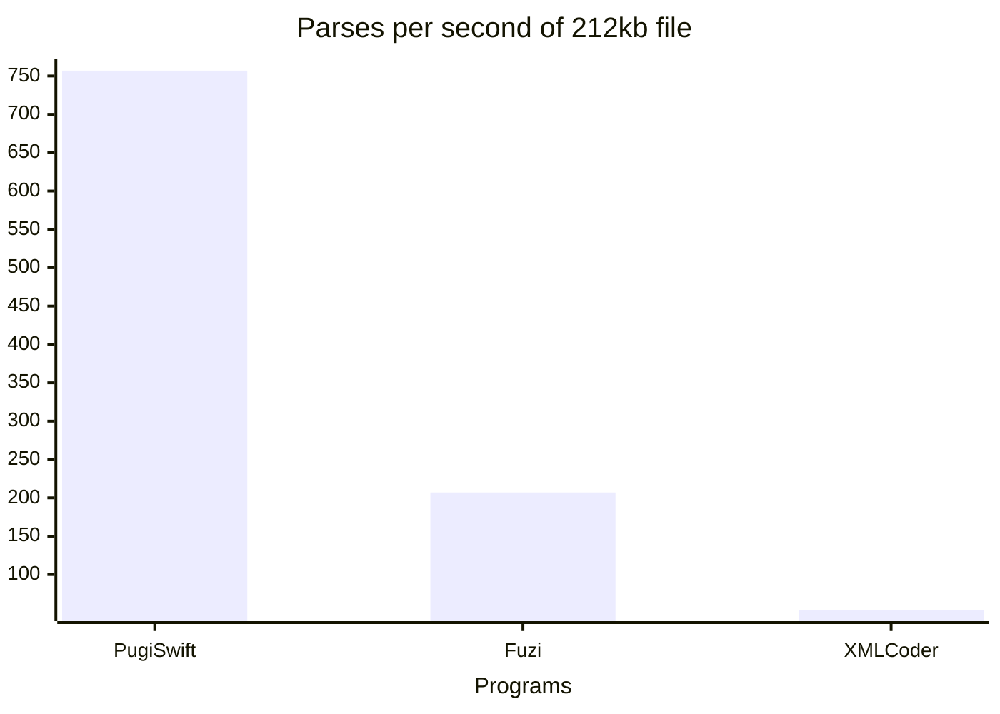

# PugiSwift
[](https://swiftpackageindex.com/elihwyma/PugiSwift)
[](https://swiftpackageindex.com/elihwyma/PugiSwift)


PugiSwift is a Swift wrapper around the C++ library [pugixml](https://github.com/zeux/pugixml). The aim is to provide a fast way to parse XML with Swift on both Apple platforms and on the server with Vapor.

The current version of pugixml bundled is [1.14](https://github.com/zeux/pugixml/releases/tag/v1.14).

pugixml is licensed under the MIT license and a copy can be found [here](Sources/pugixml/LICENSE.md).

## Benchmarking
PugiSwift has been benchmarked among other popular alterative Swift packages. The code for this benchmark is available [in this repo](https://github.com/elihwyma/PugiSwiftComparisons). The test was in Release mode with the debugger turned off. Comparisons were made against [Fuzi](https://github.com/cezheng/Fuzi.git) and [XMLCoder](https://github.com/CoreOffice/XMLCoder.git).



## Example Usage

```swift
import Foundation
import PugiSwift

@Node struct Records {
    @Attribute let value: String
    @Element(childrenCodingKey: "record") let records: [Record]
}

@Node struct Record {
    let name: String
    let list: Int
}

let str =
"""
<?xml version="1.0" encoding="UTF-8" standalone="yes"?>
<records value="Hello World">
    <record>
        <name>Paul Koch</name>
        <list>17</list>
    </record>
</records> 
"""

do {
    let records = try Records(from: str)
    print(records)
} catch {
    print("Error: \(error.localizedDescription)")
}
```

